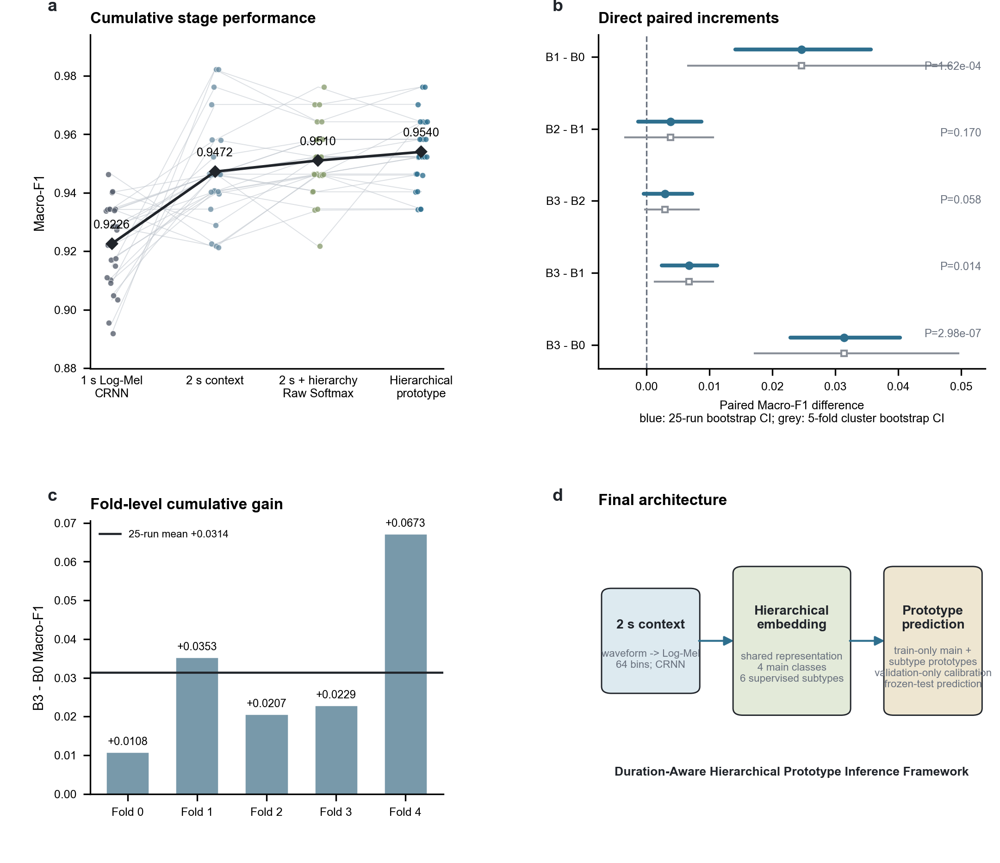
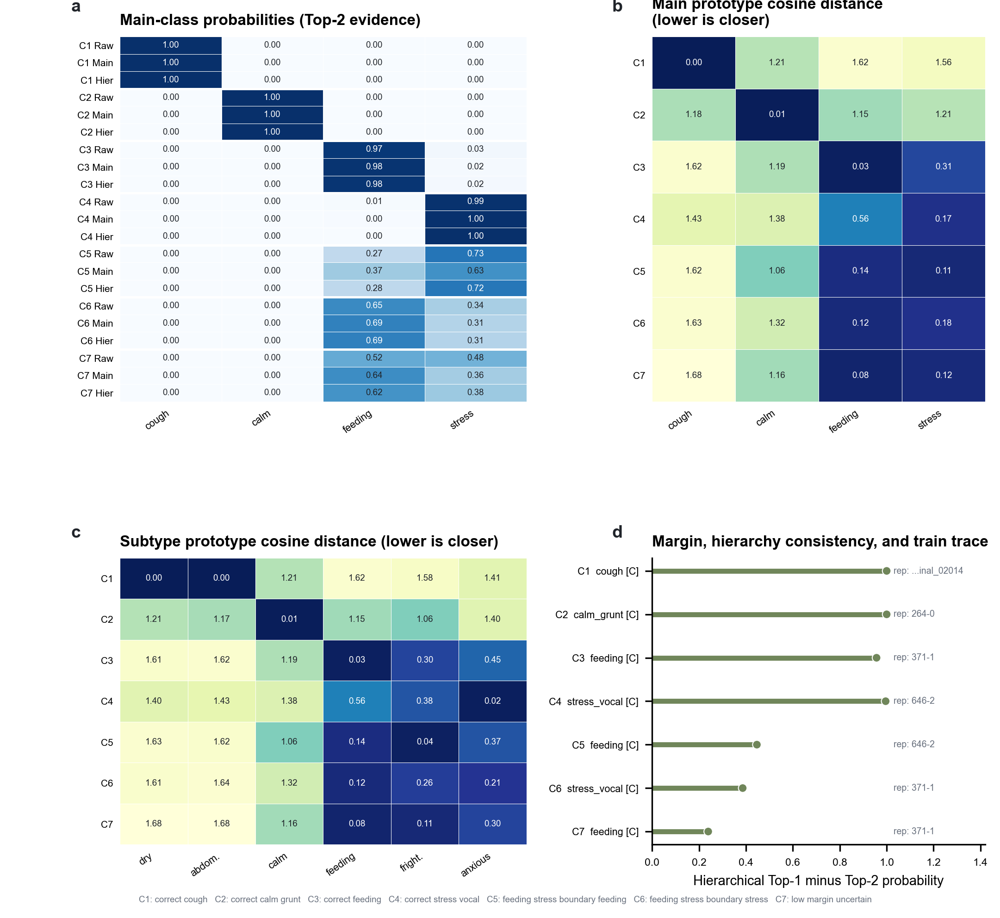

# 面向可解释猪声识别的时长感知层级原型推理框架

## 摘要

猪声识别需要覆盖完整事件、保留健康与行为相关的细粒度结构，并给出可核查的候选预测。本文构建四阶段闭集框架：1 秒 Log-Mel CRNN（B0）、2 秒时长感知 CRNN（B1）、共享四主类/六子类型辅助监督（B2）和按 fold-seed 独立构建的后验层级原型推理（B3）。全部比较采用同一 5 folds × 5 seeds 队列，并保持三重身份互斥。B1-B0 是最强且可独立支持的增量（Macro-F1 增量 0.024631；Holm P=0.000649）；B2-B1 与 B3-B2 经 Holm 校正后均不显著。但 λ=0.5 的 B2/B3 cohort 缺少事先指定或仅使用 validation 的选择记录，因此相关比较属于受 test 信息影响的回顾性探索分析。完整 B3 相对 B0 将平均 Macro-F1 从 0.922606 提高至 0.953986（增量 0.031380；95% bootstrap CI [0.022821, 0.040301]；Holm P=1.49×10^-6），且五个 fold 均值增量均为正。B3 输出主类/子类型 Top-k、距离、margin、层级一致性、不确定性字段与训练代表样本。案例仅说明输出语义。累计优势不证明各模块独立显著，也不证明统计交互或协同效应。结论限于干净闭集识别；模拟噪声结果列入补充材料，仍需真实猪场外部验证。

## 关键词

猪声识别；时长感知音频分类；层级辅助监督；原型推理；声学候选；可解释预测；CRNN

## 1. 引言

猪声可为呼吸健康、采食行为、情绪和应激状态提供非接触式监测入口 [@briefer2022pigcalls; @tallet2013piglets; @illmann2013signalneed; @weary1995calling]。既有咳嗽识别工作进一步说明了呼吸声在养殖监测中的应用价值 [@ferrari2008cough; @exadaktylos2008cough; @yin2021pigcoughcnn; @shen2022pigcoughfusion]。然而，一个面向部署的输出不能只有单个类别标签：输入窗口需要覆盖有判别力的事件结构，表示空间需要保留主类内部差异，推理结果还需要说明有哪些声学候选以及模型为何在它们之间作出选择。

本文用一句话概括框架逻辑：**“看完整事件，学细粒度结构，并以可解释声学候选进行预测。”** “看完整事件”对应时长比较；“学细粒度结构”对应四主类和六子类型的共享监督；“候选预测”对应冻结 backbone 后构建的后验原型层。这是一条功能链，而不是统计协同效应声明。

时长是首要变量。过短窗口可能截断 feeding 的重复纹理、stress_vocal 的上下文或 cough 的起始与衰减；过长窗口则可能引入更多无关背景。因此，本文首先比较相同 fold-seed 下的 1 秒与 2 秒 Log-Mel CRNN，再把已经完成的复杂前端和架构消融作为设计边界，而不是继续堆叠模块。

标签粒度是第二个变量。主任务输出 cough、calm_grunt、feeding 和 stress_vocal，但现有标签还能区分 dry_cough、abdominal_cough、frightened_stress 和 anxious_stress。四类目标并不会自动要求 embedding 保存这些差异，因此 B2 在不改变主任务的前提下联合优化六子类型辅助头。

推理语义是第三个变量。Raw Softmax 给出主类概率，但不直接说明 embedding 与主类中心、子类型中心之间的关系。B3 在每个已固定的 fold-seed run 内冻结训练完成的 B2，使用对应 train split 构建原型，使用 validation split 校准，最后在 test split 上冻结评估。这一 run 内数据角色与下文单独披露的 λ=0.5 cohort 回顾性选择局限不同。原型层返回主类/子类型候选、距离、边际、层级一致性、不确定性字段与原型代表样本。

本文贡献限定为三点：

1. 配对时长研究表明，2 秒上下文显著改善当前干净闭集任务，并比已测试的复杂前端替代方案更有效。
2. 共享四主类/六子类型监督把健康和行为相关的细粒度语义引入同一声学 embedding 空间。
3. 按 fold-seed 独立构建的后验原型层把单一 Softmax 输出扩展为主类和子类型 Top-k 候选、原型距离、决策边际、层级一致性、不确定性标记与原型代表样本。

贡献 1 的配对推断支持来自 B1-B0 时长对比；更广的已完成干净前端比较因 run 数和配对关系不同而仅作描述性证据（Supplementary Fig. S1 和 Table S1）。第三点是输出语义与解释性贡献，不能写成 prototype 增量本身显著。

## 2. 相关工作

### 2.1 两秒猪声音频与粗到细分类

2 秒猪声音频已有明确先例。PLOS pig-speech 研究使用 2 秒片段并融合频谱和时域特征 [@wu2022pigspeech]；TransformerCNN 也使用 2 秒猪声，并行结合 Transformer 与 CNN [@liao2023transformercnn]。因此，本文不把 2 秒输入包装为首次使用。两项工作的数据规模、标签、split membership、分组方式、类别平衡和指标与当前任务并不完全一致，其公开数值不能与本文 Macro-F1 直接排序。

猪声粗到细分类同样不是空白。PVMC 依次处理声活动、粗类别和情境类别，但各阶段分别训练 [@chung2025pvmc]。本文 B2 的区别是四主类与六子类型共享同一个 embedding 和联合损失，B3 则在训练结束后构建原型。该区别用于界定方法路径，不用于制造绝对首次声明。

Briefer 等将猪叫声映射到声学表示空间，并讨论了叫声词汇内部可能存在的更细结构 [@briefer2022pigcalls]。这为子类型表示提供了生物声学动机，但 embedding 中的聚集不能直接等同于已经验证的临床亚型。

### 2.2 层级原型与可解释声学原型

Prototypical Networks 以 embedding 类中心和距离完成候选推断 [@snell2017prototypical]。HiSSNet 已把层级损失和原型推理用于非猪声音事件和说话人识别 [@shashaank2023hissnet]，其 prototype 属于 episodic 训练与推理的一部分，不是本文的后验 train-only 构建。

AudioProtoPNet 已证明可解释声学 prototype 与训练样本检索可用于鸟声分类 [@heinrich2025audioprotopnet]。其正确分类是：使用可训练 prototype classifier 替换普通分类层；它不是 post-hoc prototype 方法。本文 B3 不替换分类层，也不重新训练 backbone，而是在训练完成后从匹配 train split 计算主类和子类型中心。

截至 2026 年 7 月 11 日的定向检索分别找到了 2 秒猪声、猪声粗到细分类、层级 prototype 和可解释声学 prototype 的先例，但没有定位到与本文完整路径完全一致的猪声研究。该结论只对本次检索范围有效，不是绝对首次声明。公开分数可比性表仅说明数据、标签、切分、样本单位、声学条件和指标为何不对齐，不构成排行榜。

## 3. 材料与方法

### 3.1 任务、数据与泄漏控制

闭集主任务包含 cough、calm_grunt、feeding 和 stress_vocal 四类。辅助任务包含 dry_cough、abdominal_cough、calm_grunt、feeding、frightened_stress 和 anxious_stress 六个子类型，其中两种 cough 映射到 cough，两种 stress 映射到 stress_vocal。

咳嗽录音来自 Smart Farm Korea/data.go.kr 猪咳嗽数据源 [@smartfarmkorea_pig_cough_voice]；calm_grunt、feeding、frightened_stress 和 anxious_stress 来自 Sow Call Dataset [@sow_call_dataset_2021]，本地子类型按源文件名后缀映射。许可未解决的 Kaggle-like scream/cough 文件不进入 cap3x 主线。

最终网格为 5 folds × 5 seeds，seed 分别为 42、123、777、2024 和 3407。每个 fold 内的 train、validation 和 test 按标准化 exact path、source ID 与 MD5 三重互斥。对每个已固定 run，train 用于模型参数和 prototype，validation 用于温度、融合权重、阈值与不确定性标准，test 提供冻结评估。不同 fold 或 seed 的原型、校准文件与预测从不混合。该 run 级隔离不能消除下文单独披露的、受 test 信息影响的 λ=0.5 cohort 选择局限。

### 3.2 四阶段累计框架

- **B0：** 1 秒 Log-Mel CRNN。
- **B1：** 2 秒时长感知 Log-Mel CRNN。
- **B2：** B1 加共享四主类/六子类型辅助监督，固定 λ=0.5，并使用主类 Raw Softmax 评估。
- **B3：** B2 加后验层级原型候选推理。

四阶段依次回答事件看多长、embedding 学什么结构、推理输出什么信息。实验不是全因子设计，不能估计 duration、hierarchy 与 prototype 的交互项。

### 3.3 Log-Mel CRNN 与时长比较

音频使用相同参数转换为 64-bin Log-Mel 表示 [@mcfee2015librosa]。短于目标时长的录音补零，长于目标时长的录音中心裁剪。CRNN 以卷积模块提取局部时频模式，以双向循环层整合时间依赖，再经时间池化得到固定维度 embedding。B0 与 B1 只改变输入时长，不改变类别定义和评估协议。

### 3.4 共享层级辅助监督

B2 在主类头之外加入六子类型头：

\[
L=L_{main}+\lambda L_{aux}.
\]

已经完成的 λ 比较显示，λ=1.0 的 test 均值最高，λ=0.5 的跨 run test 标准差最低。B2 和 B3 沿用既有且已冻结的 λ=0.5 原型 cohort，本次累积分析未改变该 cohort。但现有归档记录未证明 λ=0.5 由一个事先指定或仅使用 validation 的规则选出，因此本文将该选择视为回顾性且受 test 信息影响，将涉及 B2/B3 的比较视为探索性结果，且不宣称 λ=0.5 是独立选定的最优设置。

### 3.5 后验层级原型候选推理

B3 对每个 fold-seed 冻结 B2 backbone，将 train embedding 做 L2 归一化，分别计算四主类与六子类型的均值中心，并再次归一化。测试 embedding 与 prototype 的余弦相似度经 validation 选择的温度转换为候选概率；主类和子类型证据按 validation 选择的权重组合并映射回已知层级。test 数据不参与 prototype、温度、权重、阈值或融合规则选择。

B3 输出 Raw Softmax 主类 Top-k、main prototype Top-k、hierarchical main Top-k、subtype Top-k、四主类距离、六子类型距离、Top-1 与 Top-2 决策边际、层级一致性、不确定性字段，以及匹配 run 的训练集原型代表样本。该代表样本用于说明预测类别中心，不说明测试样本与某个训练样本之间的直接相似关系。

### 3.6 统计与多重性校正

主指标为 Macro-F1，并设置 `zero_division=0`。25 个匹配 fold-seed run 报告均值、样本标准差、配对增量、percentile-bootstrap 95% CI、双侧 Wilcoxon P 值和胜/平/负。fold-cluster 敏感性分析先在每个 fold 内对五个 seed 的增量求均值，再对五个 fold 均值 bootstrap。

五个计划对比为 B1-B0、B2-B1、B3-B2、B3-B1 和 B3-B0。Holm step-down 校正只使用已经保存的五个原始 P 值，没有重新生成预测或评估模型。

### 3.7 确定性案例选择

案例来自规范 expected-key 列表中事先确定的第一个数值 fold-seed 组合（fold 0/seed 42），并在该 artifact 通过完整性检查后使用；它不是按文件名字典序选出。四个正确案例要求 Raw Softmax、main prototype 和 hierarchical prototype 都预测正确，并在各主类内取 Raw Softmax 置信度的下中位行。每个 feeding/stress 边界 pool 固定真实边界类，要求 Raw 或 hierarchical Top-2 集合为 `{feeding, stress_vocal}`，且 Raw、main prototype 或 hierarchical 中至少一路主类决策错误；其中选取 Raw Top-2 margin 的下中位行。低边际案例取剩余样本中 hierarchical Top-2 margin 最小者。并列时按 source ID 决定。该规则是应用于冻结 test 输出的回顾性确定展示规则，不是调参或总体抽样估计。

## 4. 结果

### 4.1 累计框架结果

表 1 将原先分散的干净结果整合为同一 B0-B3 框架。B2 相对 B0 的累计增量只由阶段均值相减得到；B2-B0 不属于五个计划 Wilcoxon 对比，因此不附加直接 P 值。B3-B1 和 B3-B0 作为计划累计对比单独列出。

**表 1. 累计框架性能与配对推断。**

| 阶段（统计对比） | Macro-F1，均值 ± SD | 相邻增量 | 累计增量（参照） | 所列对比 bootstrap 95% CI | 原始 P | Holm P | Holm 0.05 | 胜/平/负 | fold-cluster 95% CI |
|---|---:|---:|---:|---:|---:|---:|---|---:|---:|
| B0（参照） | 0.922606 ± 0.014541 | — | 0 | — | — | — | — | — | — |
| B1（B1-B0） | 0.947237 ± 0.016764 | +0.024631 | +0.024631 vs B0 | [0.014113, 0.035642] | 0.000162303 | 0.000649214 | 是 | 21/0/4 | [0.006578, 0.048280] |
| B2（B2-B1） | 0.951050 ± 0.012393 | +0.003812 | +0.028443 vs B0，仅描述 | [-0.001320, 0.008727] | 0.170241396 | 0.170241396 | 否 | 16/1/8 | [-0.003407, 0.010561] |
| B3（B3-B2） | 0.953986 ± 0.012004 | +0.002937 | +0.031380 vs B0 | [-0.000478, 0.007294] | 0.058252952 | 0.116505904 | 否 | 13/8/4 | [-0.000220, 0.008263] |
| B3（B3-B1 累计） | 0.953986 ± 0.012004 | — | +0.006749 vs B1 | [0.002389, 0.011270] | 0.013808562 | 0.041425685 | 是 | 18/0/7 | [0.001295, 0.010597] |
| B3（B3-B0 累计） | 0.953986 ± 0.012004 | — | +0.031380 vs B0 | [0.022821, 0.040301] | 2.98023×10^-7 | 1.49012×10^-6 | 是 | 24/0/1 | [0.017174, 0.049576] |

**图 1. 时长感知层级原型累计框架。** B0 为 1 秒参照，B1 改变事件时长，B2 加入共享子类型监督，B3 加入后验原型候选推理。配对面板同时包含相邻对比和累计对比，必须结合具体对比标签解读。

B1 是最强且能够独立支持的性能增量。其 run-level CI 与 fold-cluster CI 均高于零，但 fold 0 的均值增量略为负值。B2-B1 的均值增量为 0.003812，Holm P=0.170241；B3-B2 的均值增量为 0.002937，Holm P=0.116506。两项相邻增量均不显著。

B3-B1 计划累计对比在 Holm 校正后仍达到 0.05 阈值（增量 0.006749，Holm P=0.041426），但它跨越 B2 与 B3 两个阶段，不能把差异归因于任何一个单独模块。完整 B3 相对 B0 的增量为 0.031380，胜/平/负为 24/0/1，五个 fold 均值增量依次为 0.010828、0.035278、0.020681、0.022855 和 0.067257。由于归档中的 λ=0.5 选择规则不属于事先指定或仅使用 validation，涉及 B2/B3 的对比仍属回顾性探索结果；Holm 校正不能消除该模型选择局限。累计优势仅在该冻结 cohort 内得到支持，且不等于因子交互或协同效应。

### 4.2 原型案例说明输出语义

图 2 与表 2 展示一个 cough、一个 calm_grunt、一个 feeding、一个 stress_vocal、两个 feeding/stress 边界错误以及一个按排名而非拟合阈值选出的低 margin uncertain 案例。距离为 cosine distance；margin 为 hierarchical prototype Top-1 概率减 Top-2 概率。

**图 2. 原型候选预测案例。** `[C]` 表示层级一致，不表示预测正确。图中的 representative sample 定义为 **a training sample closest to the predicted class prototype（与预测类别原型距离最近的训练样本）**，并且只能来自匹配 fold-seed 的 train split。案例用于说明输出语义，不作为总体效果证据。

**表 2. 确定性案例输出轨迹。**

| 案例；真实类 | Raw Softmax Top-2 | main prototype Top-2 | hierarchical Top-2 | subtype Top-2 | main/subtype distances | margin；层级一致性 | prototype representative |
|---|---|---|---|---|---|---|---|
| C1；cough | cough 0.999388 calm_grunt 0.000375 | cough 1.000000 calm_grunt 0.000000 | cough 1.000000 calm_grunt 0.000000 | abdominal_cough 0.502888 dry_cough 0.497112 | Main: cough 0.001481; calm 1.210585; feeding 1.619128; stress 1.555124. Subtype: dry 0.002865; abdominal 0.002056; calm 1.210585; feeding 1.619128; frightened 1.583670; anxious 1.412413. | 1.000000；是 | `data/external/korea_raw/abdominal_cough/train_abdominal_02014.wav`，cough，prototype distance 0.001087 |
| C2；calm_grunt | calm_grunt 0.999843 cough 0.000059 | calm_grunt 1.000000 feeding 0.000000 | calm_grunt 1.000000 stress_vocal 0.000000 | calm_grunt 1.000000 frightened_stress 0.000000 | Main: cough 1.179611; calm 0.010405; feeding 1.146829; stress 1.211714. Subtype: dry 1.211066; abdominal 1.165473; calm 0.010405; feeding 1.146829; frightened 1.056907; anxious 1.400100. | 1.000000；是 | `data/raw/sow_call_dataset_labeled/calm_grunt/264-0.wav`，calm_grunt，prototype distance 0.001744 |
| C3；feeding | feeding 0.965497 stress_vocal 0.034205 | feeding 0.981413 stress_vocal 0.018587 | feeding 0.978416 stress_vocal 0.021584 | feeding 0.975418 frightened_stress 0.022237 | Main: cough 1.619153; calm 1.187110; feeding 0.031840; stress 0.309496. Subtype: dry 1.610973; abdominal 1.622037; calm 1.187110; feeding 0.031840; frightened 0.296517; anxious 0.453995. | 0.956831；是 | `data/raw/sow_call_dataset_labeled/feeding/371-1.wav`，feeding，prototype distance 0.004213 |
| C4；stress_vocal | stress_vocal 0.989793 feeding 0.009866 | stress_vocal 0.996073 feeding 0.003927 | stress_vocal 0.997813 feeding 0.002187 | anxious_stress 0.993573 frightened_stress 0.005979 | Main: cough 1.425363; calm 1.376879; feeding 0.561672; stress 0.174148. Subtype: dry 1.403346; abdominal 1.434603; calm 1.376879; feeding 0.561672; frightened 0.380191; anxious 0.022279. | 0.995626；是 | `data/raw/sow_call_dataset_labeled/frightened_stress/646-2.wav`，stress_vocal，prototype distance 0.011431 |
| C5；feeding 边界错误 | stress_vocal 0.732443 feeding 0.265639 | stress_vocal 0.627354 feeding 0.372646 | stress_vocal 0.723336 feeding 0.276663 | frightened_stress 0.812211 feeding 0.180681 | Main: cough 1.619579; calm 1.056284; feeding 0.143859; stress 0.107397. Subtype: dry 1.625772; abdominal 1.616100; calm 1.056284; feeding 0.143859; frightened 0.038647; anxious 0.370351. | 0.446673；是 | `data/raw/sow_call_dataset_labeled/frightened_stress/646-2.wav`，stress_vocal，prototype distance 0.011431 |
| C6；stress_vocal 边界错误 | feeding 0.654527 stress_vocal 0.344831 | feeding 0.691019 stress_vocal 0.308981 | feeding 0.693089 stress_vocal 0.306911 | feeding 0.695159 anxious_stress 0.209725 | Main: cough 1.630480; calm 1.321099; feeding 0.123649; stress 0.179991. Subtype: dry 1.613967; abdominal 1.637040; calm 1.321099; feeding 0.123649; frightened 0.262882; anxious 0.207533. | 0.386178；是 | `data/raw/sow_call_dataset_labeled/feeding/371-1.wav`，feeding，prototype distance 0.004213 |
| C7；feeding，低 margin uncertain | feeding 0.516230 stress_vocal 0.482679 | feeding 0.644388 stress_vocal 0.355612 | feeding 0.619619 stress_vocal 0.380381 | feeding 0.594849 frightened_stress 0.377886 | Main: cough 1.683404; calm 1.157619; feeding 0.079341; stress 0.120954. Subtype: dry 1.679713; abdominal 1.684224; calm 1.157619; feeding 0.079341; frightened 0.111101; anxious 0.295133. | 0.239238；是 | `data/raw/sow_call_dataset_labeled/feeding/371-1.wav`，feeding，prototype distance 0.004213 |

C5 和 C6 尽管预测错误，层级一致性仍为真，说明该字段只衡量 hierarchical main 与 subtype-to-main 映射是否一致，不衡量正确性。C7 保留正确 feeding 输出，但较小 margin 明确暴露 stress_vocal 作为竞争候选。案例的作用是把输出合同具体化，不能用于推断总体准确率或解释质量。

### 4.3 部署边界

现有 DEMAND 分析复用冻结 clean checkpoint、train-only prototype 与 run 内 validation-only calibration [@demand2018]，现作为补充材料中的模拟加性噪声压力测试。该校准说明不能消除单独的 λ 选择局限。它没有形成真实猪场外部验证，且极端 0 dB active-event 条件仍暴露 cough 失败。因此主文结论限定在干净闭集识别与可解释候选输出。

## 5. 讨论

证据支持清晰的优先级。首先让模型看到完整 2 秒事件，是唯一获得强独立统计支持的主要增量。B1-B0 的效应明显大于后续两个相邻增量，并在 Holm 校正后保持显著。已测试的 MCTAFD、PCEN、spectral-gate、SpecAugment 和 attention-pooling 等方向未形成更强干净主线，说明当前任务中事件上下文比继续增加前端复杂度更重要。

B2 的作用不同。共享子类型监督要求 embedding 同时表达两种 cough、两种 stress、calm_grunt 和 feeding。它的正均值不足以支撑独立性能显著声明，但可以支撑细粒度表示设计和 feeding/stress 边界分析。

B3 则改变系统输出。一组主类 Softmax 概率被扩展为主类与子类型候选、距离、margin、一致性、不确定性字段和类别原型代表样本。正确案例、层级一致但错误的边界案例，以及低 margin 正确案例分别展示了这些字段如何被解释。是否能帮助养殖人员作出更好决策，仍需用户研究验证。

统计解释必须分开：B2-B1 不显著，B3-B2 不显著；B3-B0 显著，B3-B1 经 Holm 校正后达到 0.05 阈值。后两项是累计对比，不能定位某个单独模块的因果贡献。由于设计不是 factorial，本文没有 interaction term，因此只能写“累计框架收益”，不能写“协同作用”。

先验工作已经覆盖 2 秒猪声、猪声粗到细流程、层级 prototype 和可解释声学 prototype。AudioProtoPNet 尤其属于可训练 prototype classifier，而非后验原型。本文贡献应定位为在严格 fold-seed 隔离下评估的完整猪声路径与候选输出合同。定向检索未找到完全一致路径，但不能证明这种路径在所有文献中不存在。

## 6. 局限

第一，当前任务是基于第三方音频的闭集识别，没有前瞻性外部猪场队列。DEMAND 只是在干净事件上叠加环境录音，不能重建新猪场的动物、传感器、混响、空间结构与工作流程。

第二，exact path、source ID 和 MD5 互斥能够排除直接身份重叠，但 Sow Call 数据缺少完整的 animal、session、farm 和 parent-recording lineage，无法排除潜在相关源泄漏。未来应使用来源可追踪、按动物或采集会话分组的外部测试。

第三，六子类型部分来自源文件名映射，适合辅助监督和输出分析，但不能直接解释为已经验证的疾病本体。仍需独立标注与生物学验证。

第四，25 个匹配 run 是五个 test fold 内的五个 seed，并非 25 个独立数据集。fold-cluster 敏感性仅有五个 cluster；边界性的 B3-B1 Holm 结果应结合五 fold 证据解释。

第五，B2-B1 和 B3-B2 经 Holm 校正后均不显著，顺序设计也无法估计时长、层级和 prototype 的统计交互。B3-B0 只证明完整框架与参照之间存在累计差异。

第六，现有归档记录未证明 B2/B3 使用的 λ=0.5 cohort 由事先指定或仅使用 validation 的规则选出。这些比较属于受 test 信息影响的回顾性探索结果，多重性校正不能消除该局限。

第七，确定性案例只说明输出语义，不估计解释忠实度、校准、诊断效用或人类决策收益。代表样本围绕预测类别 prototype 选择，不能证明因果声学特征。

最后，本轮仅修改论文，没有训练、评估、推理或重新校准模型。全部数值结论继承冻结 25-run artifacts 的范围与假设。

## 7. 结论

本文框架遵循“看完整事件、学细粒度结构、以可解释声学候选进行预测”的顺序。2 秒时长变化提供最强且可独立支持的增益；共享子类型监督增加语义结构，但没有显著相邻增量；后验 prototype 增加候选与距离信息，但 B3-B2 也不显著。在冻结但回顾性选择的 λ=0.5 cohort 内，完整 B3 相对 B0 显著提高 Macro-F1，且五个 fold 均值增量均为正；由于 λ 选择记录受 test 信息影响，该框架层面对比仍属探索性结果。

这一结果支持完整闭集框架，不支持模块逐一显著、统计交互、协同效应或真实猪场鲁棒性。下一步应是外部来源分组验证，以及对解释输出实际使用价值的前瞻性评估。

## 补充材料

详细 DEMAND 结果和原主文噪声图移入补充材料。在 framework v2 中，Supplementary Figures S1-S5 依次映射到 `figure_s1_clean_ablations`、`figure_s2_demand_environment_snr`、`figure_s3_confusion_calibration_fold_deltas`、`figure4_simulated_noise_robustness` 和 `figure5_failure_selective_prediction`。Supplementary Tables S1-S5 依次映射到干净消融（`table2_clean_baseline_and_architecture_ablations.csv`）；噪声分层与完整 DEMAND 汇总（`table6_simulated_noise_robustness_by_stratum.csv`、`noise_25_run_summary.csv`）；run/fold 配对分析（`table7_paired_statistics.csv`、`noise_25_run_cluster_bootstrap.csv`）；逐类失败（`table8_per_class_noise_results_and_confusion_directions.csv`、`noise_25_run_per_class_summary.csv`）；以及 selective prediction（`table9_selective_prediction_metrics_corrected_augrc.csv`、`noise_25_run_selective_summary.csv`、`noise_25_run_aurc_augrc_summary.csv`）。该 v2 映射取代 Figures 4/5 的旧主图编号。这些材料只定义模拟部署边界，不构成真实猪场验证。

## 数据可用性

项目仓库和/或论文 Supplementary Data 提供聚合表、配对统计、图源映射、许可允许的 fold manifests 以及基于 hash 的泄漏与 provenance 审计。第三方原始猪声音频不再分发。Smart Farm Korea/data.go.kr 咳嗽录音应从原提供方获取 [@smartfarmkorea_pig_cough_voice]，Sow Call Dataset 应从 figshare 获取 [@sow_call_dataset_2021]，DEMAND 环境录音应从 Zenodo 获取 [@demand2018]。许可未解决的 Kaggle-like 来源不进入主结果。

## 代码可用性

历史版 `v0.1-paper-draft-r1` 复现包位于 https://github.com/HinataQAQ/pig-sound-classification/releases/tag/v0.1-paper-draft-r1，但其早于 framework-v2 累积与案例 artifacts。因此投稿前必须发布带版本的 framework-v2 复现包。本文不声明 software DOI。checkpoint、prototype artifact、DEMAND 音频和第三方原始猪声仅在许可兼容时另行发布。

## 伦理声明

本文没有开展新的动物实验、动物干预或前瞻性猪场录音，属于对公共或第三方猪声音频和 DEMAND 环境录音的计算复用。原始来源的许可、repository terms 和动物伦理审批归原数据提供方。

## 参考文献

引文元数据维护在 `paper/references/references.bib`。
